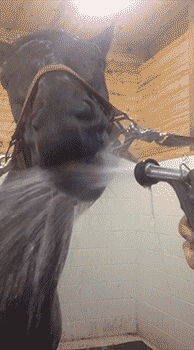
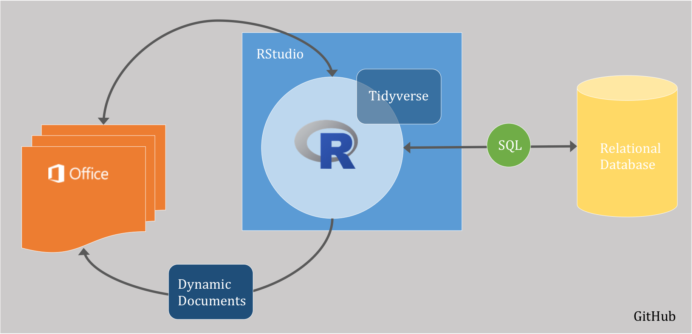

[//]:One thing you can expect from this course is the use of comics, cliches, and cultural references
[//]:I know will be the only exposure to culture for some of you

[//]:For example, they say you can lead a horse to water, but you can't make it drink and people often use this metaphor in teaching. But it's not true.

## You *can* make a horse drink

## But there are better ways to treat a horse
 

[//]:But more seriously, the title of this course is Data Stewardship, so what we really want you to become are model citizens of science. Since most of us work in Earth Systems, we are probably all familiar with the concept of land stewardship. A person may own a piece of land and may pour their own blood, sweat, and tears into making something of it, but in the end the land is passed to some one else and what they are able to do with that land has already been determined by the person that came before them. If the previous owner treated the land poorly, there will not be much anyone can do without a whole lot of work and investment.  If the previous owner was a good steward, there will be a lot more possibilities of what the land can produce. The same is true for your data. You may feel like all the work you do means that you own your data, but in the end, it will go out into the world and your level of stewardship will determine how much people can do with it. No one can really own data.   

##A few reasons data stewardship is important
 * A solid data management plan is now required by federal agencies (NSF, NIFA)
    + Includes requirements for data storage, preservation, sharing, and public access
 * Good stewardship will make you more efficient, faster, and powerful
    + Be kind to your future self
 * The most will be made of data that took a lot of time and money to collect
    + People want your data
 
##How to be a good data steward
 * Work in a style that encourages others to understand and reproduce what you did
 * Document every step of the process
 * Do not misplace or destroy your data
 
Many of us need new skills to be better stewards.
 
##Learning curve and time
  * Learning new skills is not easy
     + open mind
     + **patience**
     + determination
     + committment
  * Invest time now to save time later

##What we will learn in this course
 * Tools needed for collaborative workflow
 * How to create good data
 * How to structure and store data
 * Tools and theories needed to efficiently work with data
 * Data visualization
 * How to make a reproducible and dynamic workflow
 * How to get more data and work with special cases
 
##Live in new worlds, but visit the old 
 [//]:* 
  
 
##Homeworks
 * All homeworks will be submitted on GitHub and must be fully reproducible by the instructors
 * Individual short exercises (25%)
 * Group short exercises (25%)
 * Blog posts (10%)
 
Friday classes will be lab sessions, but we usually will not work on homework during lab

##Course Project -- 40%  
The final project will integrate everything from class.  
* You will work in self-selected groups of 3-4  
* The final result will be a reproducible story about data  
   +Report and short presentation

##Getting Help  
1. The internet
  + StackOverflow
  + Google
2. Instructors via GitHub  

##Introductions?

##Pre-course evaluation

##The computer situation

 

