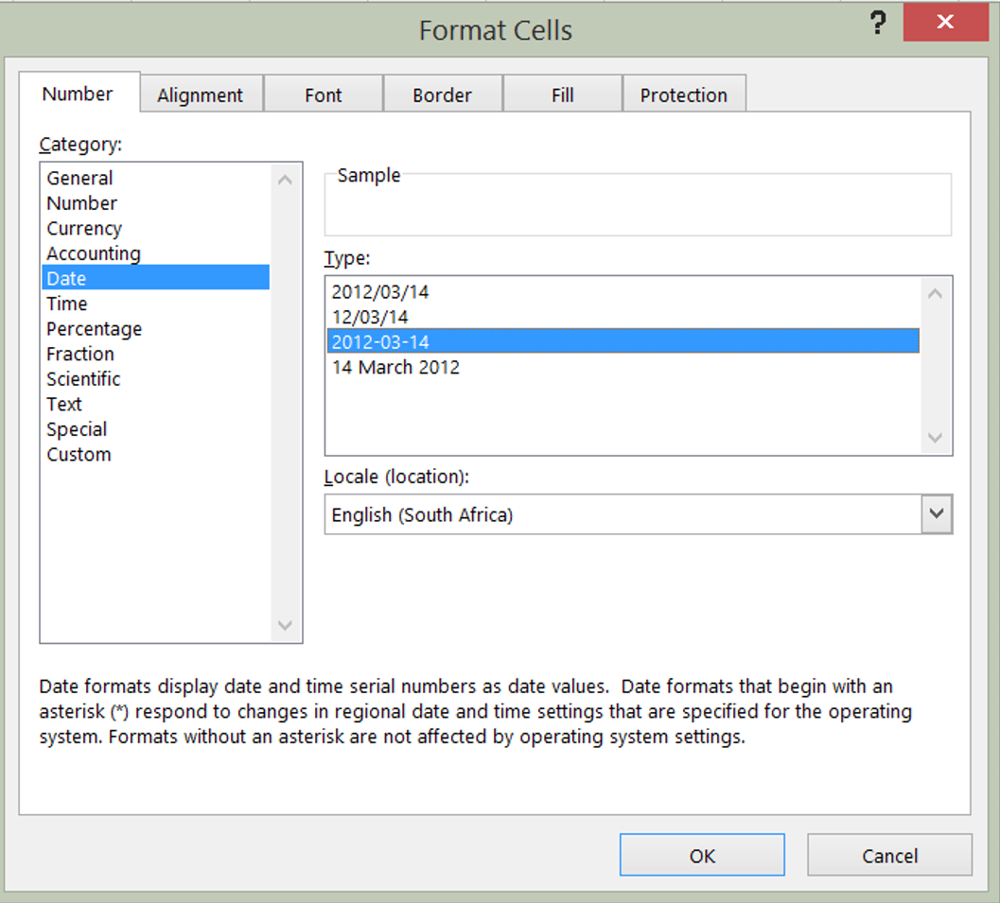

#The very beginning
 
## Experimental design
* Reproducibility and collaboration begin before you head to the field or lab  
* If you are going to work with a statistician (and you should), talk with them when you are designing your project  
* Search for data related to your field site to determine expected variability and potential problems  
* Set up a GitHub repo and introduce the crazy idea of version control to your collaborators  
 

## Experimental design  
Ask for advice and then actually consider what people say 
 

  
## Collecting data
* Establish a recorded protocol complete with references  
* Test if everyone can follow the protocol before they are left on their own  
* Bring the protocol with you to the field and record deviations  
* Name everything that is unique -- each chamber, depth, or rep 
  
## Collecting data  
* Take notes on anything that might be slightly relevant, but don't go overboard -- you should have established most of the required information before you got to the field/lab  
* Take pictures/video in the field/lab until your coworkers are just beyond the point of total annoyance  

**Do not assume you will remember anything. Remembering indicates there is a piece of data that exists only in your head!**  

## Collected data
* If your data exists only on paper -- scan or photograph the paper  
  + There will be an error and you'll need to refer back  
* Make data entry as easy as possible for those entering data  
* If data collection was automated, keep it just as it comes in  
**Never manually change your raw data**

##Once you have the data, organize it according to Karl Broman's [spreadsheet data organization](http://kbroman.org/dataorg/) 

##Be consistent  
* Use consistent codes for variable names  
  + Not "Soy", "soy", "Soybean"
* Use a single fixed code for any missing values  
  + NA, NAN, . . .  
* Use consistent codes for categorical variables
  + Location - "Arm", "Lewis", "Lew"  
*Use common data layout if you have multiple files  

##Write dates as YYYY-MM-DD  
 

##Excel is a date monster  
 

  
Be very, very careful.

##Fill in all of the cells  
* If a cell is blank, no one knows if it is intentional or if the data are missing  
* Don't depend on one cell to cover the information for several cells, you may understand, but a computer won't

##Put just one thing in a cell  
* Separate the information as well as you can  
* For example, don't combine block "A" and plot "23" as "A23", or you will need to separate that information later

##Make it a rectangle  
* Rows should correspond to identifiers (blocks, treatments, reps)  
* Columns should correspond to variables  
* If you treat your spreadsheet like a virtual desk with data and calculations and graphs spread all over the place, even other humans are going to have a tough time  
More on tidy data later

##Create a data dictionary
* Keep a separate file that explains what everything is (also in a rectangle)  
  + Exact variable name  
  + Version of name used for visualization  
  + Long explanation of the variable  
  + Measurement units  

##No calculations in raw data files  
  *If you just can't wait, make a copy and create your messes there

##Don't use font color or highlighting as data  

text here

* No one can be sure what you mean  
* Computers can't pick up on it  
* *Words* provide more information, so include notes in a different column  

##Choose good names for things  
* So hard  
* Don't use spaces  
* Avoid special characters($, @, %, #, &, *, (, ), !, etc.)  
* **Short, but meaningful**  

##Make backups  
* Best policy is three locations  
  + One local (hard drive/server)
  + One off-site (GitHub)  
  + Another one off-site, preferably hosted in a different region (Dropbox, Cybox)  

##Save data in plain text files  
* This is a non-proprietary format, so anyone can open it at any point in the future  

##Further resources
[Jenny Bryan's Spreadsheet Page](https://github.com/jennybc/2016-06_spreadsheets)  
[Data Carpentry Workshop](https://github.com/datacarpentry/spreadsheet-ecology-lesson/blob/gh-pages/02-common-mistakes.md#tables)  
[Checklist from rOpenSci](http://ropensci.github.io/reproducibility-guide/sections/checklist/)  
Also very good:  
[How to share data with a statistician](https://github.com/jtleek/datasharing)  