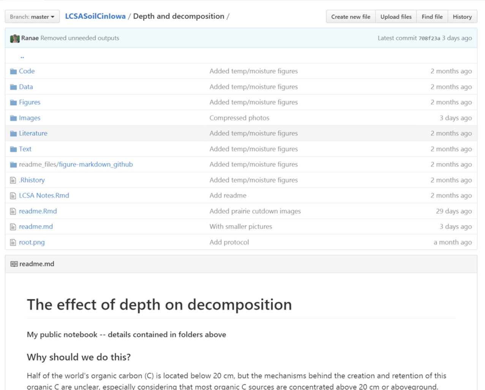
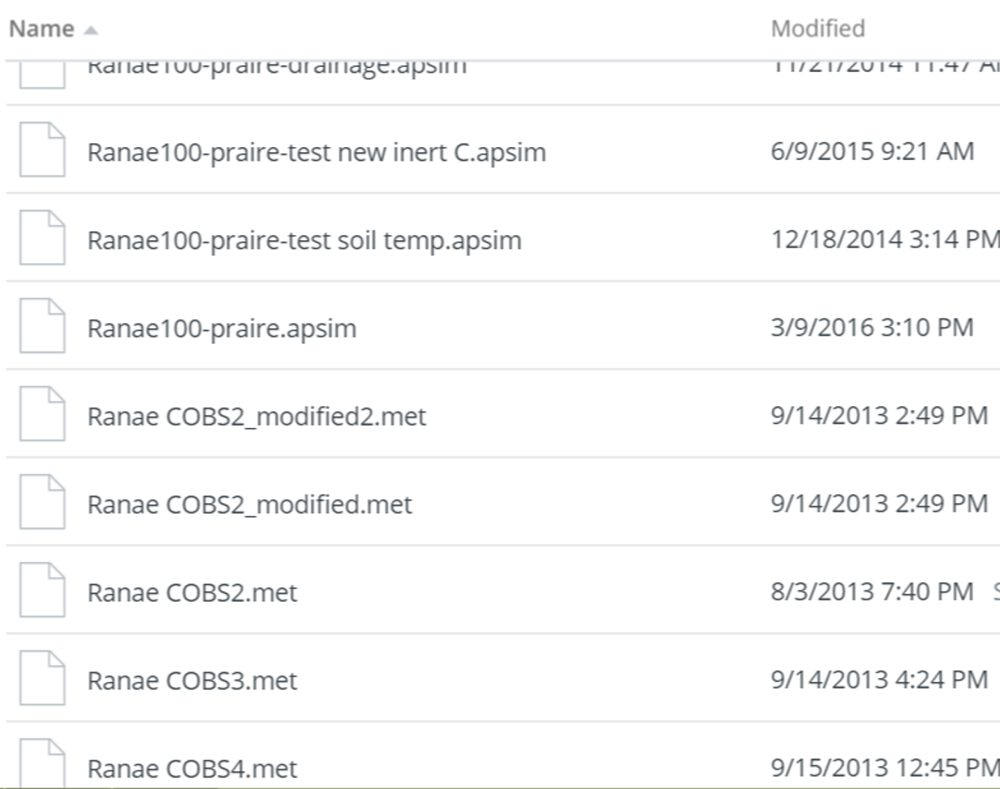
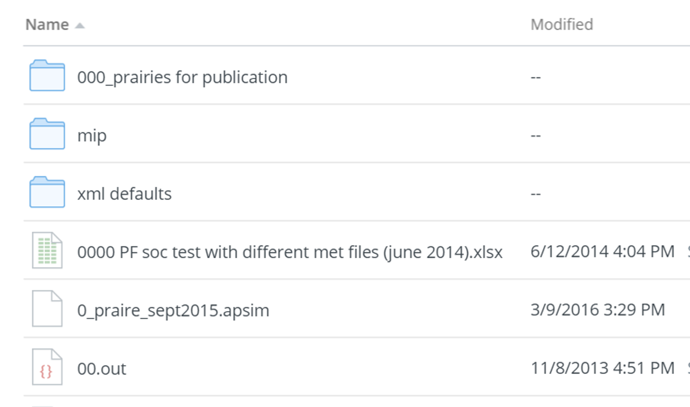

```{r setup, include=FALSE}
knitr::opts_chunk$set(echo = FALSE)
```
##When you open a bad folder  
 <center></center>
 
#Reproducible Research

## Why
**If you have to do something once, you are going to have to do it 1000 times**  

* analysis is iterative  
* requests/collaborators are unpredictable  
* data grows  
  
If you can't reproduce what you did, it's impossible to find the mistakes  
If you can't reproduce what you did, it is not credible
  

## Why
* If you can reproduce what you did, others can too  
* They can either use the information to perform similar analyses, or build upon all the work you did  
 

##The best thing you can do is to start every project with the goal and mindset of reproducibility.  
 <center></center>  
**Stop working in the dark. Realize that everything you do will eventually be seen.**


 
##Steps to reproducible research  
Karl Broman, Department of Biostatistics & Medical Informatics  
University of Wisconsin-Madison  
[kbroman.org](kbroman.org)  
@kwbroman  
 <center></center>


##Everything with a script
* A script is a sequence of code that performs a specific job
* Pointing, clicking, dragging, dropping, copying, pasting are not reproducible
* Code tracks and records every step you take  
* Get data -> convert file -> edit file -> clean data -> analyze data
* Still possible to write terrible scripts though

##Organize your data and code  
* Use one directory (local) and one repo (GitHub) for one project
* Put code and data in separate subdirectories  
<center></center>  

##Organize your data and code  
<center></center>


##Organize your data and code
* Use relative paths that refer only to the project directory and not to your specific computer  
*Good:* images/friends.gif  
*Bad:* C:/Users/rdietzel/Documents/materials/week_02/images/friends.gif  
<center></center>  
This will save your friends a lot of trouble when they run your code on their computer

##Organize your data and code
Write ReadMe files (component of metadata)  

* The ReadMe file is the first to be seen or sought  
* Describe the files in your folder, especially which order to run them in  
* Leave a map for those that come after you, or your future self  
<center></center> 


##Automate the process 
* Aim to write a script of your scripts  
  + This also helps you mentally organize the steps you need to take in your project  
* Rerunning your project happens with the touch of a button  
  + Do months of work over and over and over whenever you need to  
* Broman recommends GNU Make, but R is sufficient for this course

##Turn scripts into reproducible reports  
* Include enough text in your scripts that future you and anyone else will know __why__ you did what you did
* We will devote time to reproducible reports later in the semester 

##Turn repeated code into functions  - more later    
* A function is a command made up of other code, e.g. mean, standard deviation
* Your code will be a lot easier to read and faster to write  
* Package up these functions to share and use later  


##Use version control  
* You are already doing this with GitHub!    

##Totally worth spending class time on file naming  
 <center></center>  

##[Naming things](https://github.com/jennybc/organization-and-naming/blob/master/naming-things/naming-slides.pdf)
Jennifer Bryan, Statistics and Micheal Smith Labs    
University of British Columbia
http://www.stat.ubc.ca/~jenny  
@JennyBryan  
 <center></center>  

##File names should  
be machine readable  
be human readable  
play well with default ordering

##Machine readable means  
Regular expression and globbing friendly  

* Avoid spaces, punctuation, accented characters, case sensitivity  

Easy to compute on  

* Deliberate use of delimiters  

##Globbing  
 <center></center>  
 
##Human Readable  
Name contains info on content  
<center></center>

##Plays wells with default ordering  
Put something numeric first
Use YYYY-MM-DD for dates  
Left pad other numbers with zeros (01 instead of 1)  
<center></center>  
Not cool to manipulate default ordering with ill intentions


##Plan your naming scheme  
* Picture what your files, folders, project, and degree program will look like  
* Name your file when you create it, not just before you need to run out of your office  

#[Data Management and Sharing Snafu in Three Short Acts](https://www.youtube.com/watch?v=N2zK3sAtr-4)


