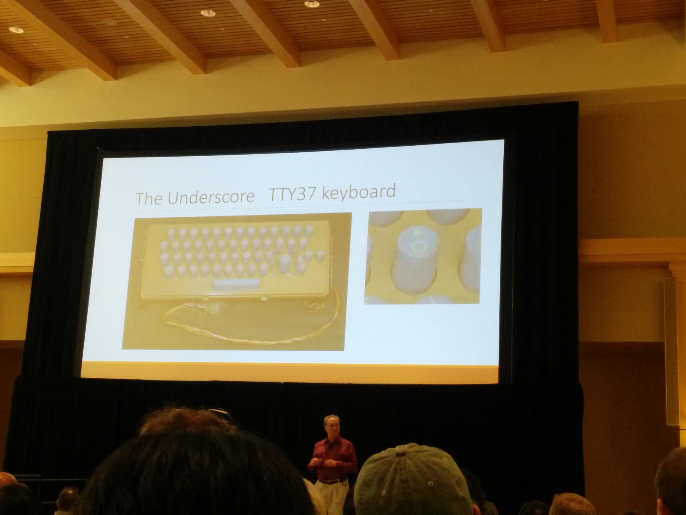

## Basic `R`

  

## `R` as a huge calculator

```{r}
#addition, subtraction, multiplications, powers
2 + 3
3^3
2/7
3*108

#modulo (remainder)
33%%4 
```

## Using functions

Functions are reusable pieces of code. `R` has a ton of functions built in, and even more that you can load separately (packages)

```{r}
#pass values to functions as parameters
log(2, base = 2)
exp(1)
cos(2*pi)
```

## Storing values

We can store numbers or the results of calling functions for later use in **variables** using the assignment operator `<-`. 

```{r}
#assignment
x <- 10
y <- cos(2*pi)
```

We can then use these variables later, for more calculation

```{r}
#calculation on variable values
exp(x)
x^y
```

## Why the funny arrow assignment?

Why don't we just use `=` (which also works)?

- directional assignment, can also use `->` for assigning left to right
- history/quirks




## Variable creation tips

- Variable names can't start with a number or underscore
- Variables (and everything) is case sensitive in `R`
- Avoid names that are already used in `R` (`c`, `I`, `T`, `F`, `t`, `q`)
- Some words are reserved (`for`, `if`, `in`, `while`, `else`, `repeat`, `break`, `next`)
- Be consistent with your capitalization and underscores (`camelCase` vs. `snake_case` vs. `caterpillar.case`)
    - I prefer `snake_case` because you never have to remember capitals and the `.` can have consequences later.

## Vectors

We can store multiple values in a variable using vectors. To create a vector, we can **combine** values (`c`), or use **sequencing** functions.

```{r}
#combine values
(nightstand_books <- c("Harry Potter and the Goblet of Fire", "A Storm of Swords", "On Writing Well", "Advanced R", "R Packages"))

#sequences
(nums <- 1:10)
(nums_2 <- seq(1, 10, by = 2))
```

## Your turn {.white}

[helpful functions](https://cran.r-project.org/doc/contrib/Short-refcard.pdf)

## Data frames

## Accessing parts of data

## Logicals

## Your turn {.white}

## Data types

## Moar functions

