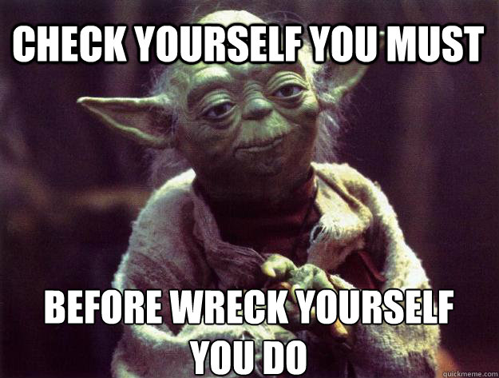

# Dataframes

## DIY Dataframe

Good to know for making simple examples  

```{r}
block = c("A", "B", "C", "A", "B", "C")
rep = c(1, 2, 1, 2, 1, 2)
mass = c(52, 48, 33, 32, 44, 49)
df = data.frame(block, rep, mass)
```
 
What have you done?  
```{r, eval=FALSE}
plot(df$mass ~ df$rep)
df$rep <- as.factor(df$rep)
plot(df$mass ~ df$rep)
```

If you get an error message, check your class!

##  

<center></center> 

## Importing data  

Check your working directory. 
`getwd()`  
Change your working directory.
`setwd()`  
Import your file  
`df <- read.table("file.txt", header = TRUE)`  
`df <- readr::read_csv("file.csv")`

For Excel files, look in to the `readxl` package  

## Subsetting  

**%in%** (?'%in%') (use quotes when looking up weird stuff)

* match  
* use instead of `==` when you have more than one    
* `df[df$year %in% c(2008, 2009, 2010),]`   

**|** means "or" 

* `df$ET[df$ET < 0 | df$ET > 10] <- NA`

otherwise `&` means "and"  

#`[]` vs `[[]]`

##  
* `[]` always gives you a list  
* `[[]]` gives you the content of the list  
* This difference will become more important when we get into functions

#Let's import and subset  


## Your turn { .cover .white }

<!-- image source https://www.flickr.com/photos/ollemhebb/16691684354/in/photolist-rqZfeh-dB2HGy-j4rtWV-cswQCb-bnmKUX-rurYD7-5vmdw6-7iHPtj-bvggjZ-7nwAyK-oVZdhD-acwkds-dqAf8f-e4z5Jk-6PBenY-dSAYZ9-5vmcGR-e4z7be-cyGrpE-7WLPaw-5vmdnn-8ciEWU-5vmcDa-o2NbGq-dxpJTW-cyGt4d-dZy9Sm-dZssjK-oVZ3SB-5BtrCp-e4z5Mk-6bvjNs-8cfk5H-dzTiW2-7Yfj3T-9mraHV-5XmJTS-aDtnzj-ruXg4M-ecF3x2-aAU6Fg-bsQosb-Hgh9UM-kJti5g-ifdCE4-ceXXhf-7AdkFZ-aEDYpr-otaizi-sa1Phn -->


<ol style="color:black">
<li>Look at the NASS soybean data from 1900 to 2015.</li>
<li>Make an XY plot of soybean acres planted vs soybean acres harvested. </li>
<li>Compare "acres harvested" of small grains (oats, barley, wheat, and rye) to "acres harvested" of corn and soybean over the last 100 years.</li>
</ol>

