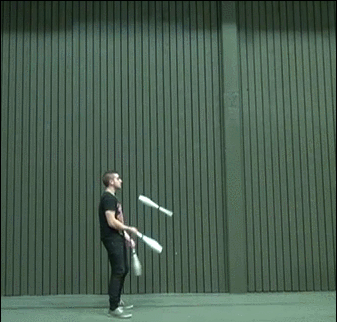

#Dates in the Tidyverse 
#`lubridate`

##   

<p style="color:white">Life before `lubridate` was so hard.</p>
<p style="color:white">We will not even venture down this road.</p>
<p style="color:white">When you encounter non-lubridate date code, be strong.</p>
    
##Write dates as YYYY-MM-DD  
 <center></center>
 xckd.com

## When is the last time you recieved a date in the right format?

Getting R to recognize a date is usually the first step  
```{r, include= FALSE}
library(lubridate)
```

```{r}
dates<-c("10/20/2016", "10/21/2016", "10/22/2016")
mdy(dates)
```
Now we are good.  

##`parse_date_time`  

```{r}
parse_date_time("2014-09-24 15:23:10", orders="ymd hms")  
parse_date_time("09/24/2014 15-23-10", orders="mdy hms")
parse_date_time("24 09 2014 15 23 10", orders="dmy hms")
parse_date_time("24-09-14 15-23-10", orders="dmy hms")
parse_date_time("Sep 24, 2014 15:23:10", orders="mdy hms")
```

##Now we can isolate components of our dates  
```{r}
month("2016-10-21")
day("2016-10-21")
year("2016-10-21")
```

##Day of year!  

```{r}
yday("2016-10-21")
yday(mdy(dates))
```

##Also handles intervals  
For example, when can Andee prepare for her prelim?
```{r}
now<-Sys.time()
prelim<-"2016-10-25 09:00:00 CDT"
prep<-now %--% prelim 
prep
```
When will Ranae be at a Software Carpentry Instructor workshop?
```{r}
depart<-"2016-10-23 12:00:00 CDT"
return<-"2016-10-25 20:00:00 CDT"
workshop<- depart %--% return
workshop
```

##
Will Andee and Ranae be occupied at the same time?
```{r}
int_overlaps(prep, workshop)
```
When will Andee and Ranae both be unavailable?
```{r}
setdiff(prep, workshop)
```

##
[Eric Hare](http://erichare.me/) will teach class at 2016-10-24 10:00:00. 
<center></center>

##If anyone drove a time machine, they would crash -Grolemund

The length of months and years change so often that doing arithmetic with them can be unintuitive. Consider a simple operation, January 31st + one month. Should the answer be  

1. February 31st (which doesn't exist)
2. March 4th (31 days after January 31), or
3. February 28th (assuming its not a leap year) 

##  
Lubridate does arithmetic with dates, but you still have to think about it and make decisions about what you really mean and want.  

However, there are helpful functions such as:

How long does Andee have to prepare for her prelim?
```{r}
as.period(prep %% months(1))
```

##More practice  
Pull in lab materials for practice with lubridate and dplyr.
<center></center>
