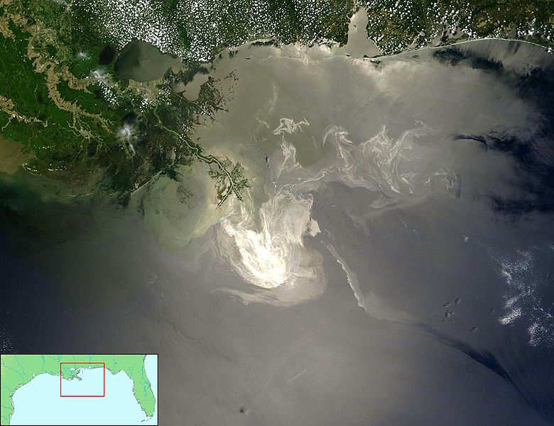

#Plotting with Layers
#`ggplot2`

## Deepwater Horizon Oil Spill



## Datasets

NOAA Data:

- National Oceanic and Atmospheric Administration
- Temperature and Salinity Data in Gulf of Mexico
- Measured using Floats, Gliders and Boats

US Fisheries and Wildlife Data:

- Animal Sightings on the Gulf Coast
- Birds, Turtles and Mammals
- Status: Oil Covered or Not

Both data sets have geographic coordinates for ever observation

## Loading NOAA Data

NOAA data is a .rdata file so we need to read it specially:

1. Download the data from http://heike.github.io/rwrks/02-r-graphics/data/noaa.rdata
2. Run the `getwd()` command to find your current working directory
3. Place noaa.rdata in the directory from step 2.
4. Run the command below:

```{r, eval=FALSE}
library(ggplot2)
library(maps)

load("noaa.rdata")
```

```{r, echo=FALSE}
library(ggplot2)
library(maps)

load("data/noaa.rdata")
```

## Floats

Lets take a peek at the top of the floats NOAA data.

```{r}
head(floats, n = 2)[,1:5]
head(floats, n = 2)[,6:10]
head(floats, n = 2)[,11:14]
```

## Floats Plot

```{r, fig.height=4, fig.width=7}
qplot(Longitude, Latitude, colour = callSign, data = floats) + 
    coord_map()
```

## Gliders

```{r, fig.height=4, fig.width=7}
qplot(Longitude, Latitude, colour = callSign, data = gliders) + 
    coord_map()
```

## Boats

```{r, fig.height=4, fig.width=7}
qplot(Longitude, Latitude, colour = callSign, data = boats) + 
    coord_map()
```

## Layering

This data has the same context - a common time and common place

- Want to aggregate information from different sources onto a common plot
- Start with a common background the lat/long grid
- With `ggplot2` we will superimpose data onto this grid in layers

## Layers

To give you an idea...

```{r, fig.height=3, fig.width=7, warning=FALSE}
states <- map_data("state")

ggplot() +
    geom_path(data = states, aes(x = long, y = lat, group = group)) + 
    geom_point(data = floats, aes(x = Longitude, y = Latitude, colour = callSign)) +   
    geom_point(aes(x, y), shape = "x", size = 5, data = rig) + 
    geom_text(aes(x, y), label = "BP Oil Rig", 
              size = 5, data = rig, hjust = -0.1) + 
    xlim(c(-91, -80)) + ylim(c(22,32)) + coord_map()
```

## More Layering

- Most maps (and many plots) have multiple layers of data. The layers may be from the same or different datasets.
- ggplot2 builds around this same idea. Very easy to add additional layers to the plot. To do this we need to understand a little more about the underlying theory...

## What is a Plot?

- A default dataset 
- A coordinate system
- layers of geometric objects (geoms)
- A set of aesthetic mappings (taking information from the data and converting into an attribute of the plot)
- A scale for each aesthetic
- A facetting specification (multiple plots based on subsetting the data)

## Floats Decomposed

- **Data**: floats
- **Mappings**: 

aesthetic mapping
--------- ---------
x         Longitude
y         Latitude
color     CallSign

- **Layers**: Points
- **Scales**:

aesthetic scale
--------- ---------
x         continuous
y         continuous
color     discrete

**Facetting**: None

## `qplot()` vs `ggplot()`

`qplot()` stands for "quickplot":

- Automatically chooses default settings to make life easier
- Less control over plot construction

`ggplot()` stands for "grammar of graphics plot"

- Contructs the plot using components listed in previous slides

## `qplot()` and `ggplot()` for Floats

Two ways to construct the same plot for float locations:

```{r, eval=FALSE}
qplot(Longitude, Latitude, colour = callSign, data = floats) 
```

Or:

```{r, eval=FALSE}
ggplot(data = floats, 
       aes(x = Longitude, y = Latitude, colour = callSign)) +
  geom_point() + 
  scale_x_continuous() + 
  scale_y_continuous() + 
  scale_colour_discrete()
```

## We can shorten that a bit

We fortunately don't need to be so verbose - Even `ggplot()` will automatically pick default scales:

```{r, fig.height=3, fig.width=7}
ggplot(data = floats, 
       aes(x = Longitude, y = Latitude, colour = callSign)) +
  geom_point()
```

## Your Turn {data-background=#527a7a}

Find the `ggplot()` statement that creates this plot:

```{r, fig.height=4, fig.width=7, echo=FALSE, warning=FALSE}
ggplot(aes(x = Depth, y = Temperature, colour = callSign), data = floats) + geom_point()
```

## What is a Layer?

A layer added `ggplot()` can be a geom...

- The type of geometric object
- The statistic mapped to that object
- The data set from which to obtain the statistic

... or a position adjustment to the scales

- Changing the axes scale
- Changing the color gradient

## Layer Examples

Plot               Geom             Stat
------------------ ---------------- -----------------
Scatterplot        point            identity
Histogram          bar              bin count
Smoother           line + ribbon    smoother function
Binned Scatterplot rectange + color 2d bin count

More geoms described at http://docs.ggplot2.org/current/

## Piecing Things Together

Want to build a map using NOAA data

- Coordinate system (mapping Long-Lat to X-Y)
- Add layer of state outlines
- Add layer of points for float locations
- Add layers for Oil Rig marker and label
- Adjust the range of x and y scales

## The Result

```{r, fig.height=3, fig.width=7, warning=FALSE}
ggplot() +
    geom_path(data = states, aes(x = long, y = lat, group = group)) + 
    geom_point(data = floats, aes(x = Longitude, y = Latitude, colour = callSign)) +   
    geom_point(aes(x, y), shape = "x", size = 5, data = rig) + 
    geom_text(aes(x, y), label = "BP Oil Rig", size = 5, data = rig, hjust = -0.1) + 
    xlim(c(-91, -80)) + 
    ylim(c(22, 32)) + coord_map()
```

## Your turn { .cover .white }


<ol style="color: white">
<li>Read in the animal.csv data:</li>

```{r}
animal <- read.csv("http://heike.github.io/rwrks/02-r-graphics/data/animal.csv")
```

<li>Plot the location of animal sightings on a map of the region</li>
<li>On this plot, try to color points by class of animal and/or status of animal</li>
<li>**Advanced**: Could we indicate time somehow?</li>
</ol>
