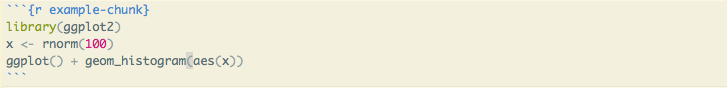
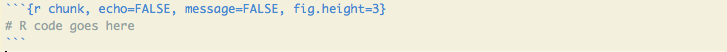
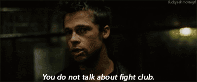
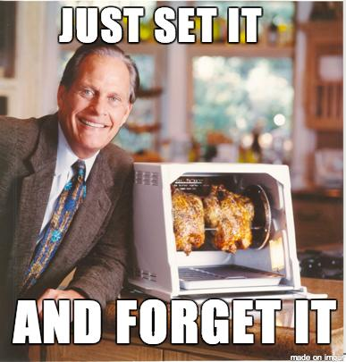

## Be like Sloth, Sloth love chunk

<iframe width="560" height="315" src="https://www.youtube.com/embed/QWr30uoSCrw" frameborder="0" allowfullscreen></iframe>

## Code chunks

(As you know) we can insert code into our R markdown documents via chunks, to be evaluated via `knitr`



```{r example-chunk, echo=FALSE, message=FALSE, fig.height=3}
library(ggplot2)
x <- rnorm(100)
ggplot() + geom_histogram(aes(x))
```

## Chunk options

There are many many options that govern the behavior, look, and output of chunks in a dynamic document. We write chunk options in the form `tag=value`:



```{r chunk, echo=FALSE, message=FALSE, fig.height=3}
# R code goes here
```


## Rules

1. You do not talk about chunk options.
1. You do not talk about chunk options.
1. Chunk options must be written in one line; no line breaks are allowed inside chunk options.
2. Avoid spaces and periods in chunk labels and directory names.
3. All option values must be valid R expressions just like how we write function arguments



## Commonly used (by me) options

- `message=FALSE`
- `error=FALSE`
- `warning=FALSE`
- `echo=FALSE`
- `eval=FALSE`
- `include=FALSE`
- `fig.cap="This is the caption for my beautiful figure!"`
- `fig.height=4`, `fig.width=6`
- `fig.show="hold"`

## Your turn { .cover .white }

<!-- image source https://www.flickr.com/photos/ollemhebb/16691684354/in/photolist-rqZfeh-dB2HGy-j4rtWV-cswQCb-bnmKUX-rurYD7-5vmdw6-7iHPtj-bvggjZ-7nwAyK-oVZdhD-acwkds-dqAf8f-e4z5Jk-6PBenY-dSAYZ9-5vmcGR-e4z7be-cyGrpE-7WLPaw-5vmdnn-8ciEWU-5vmcDa-o2NbGq-dxpJTW-cyGt4d-dZy9Sm-dZssjK-oVZ3SB-5BtrCp-e4z5Mk-6bvjNs-8cfk5H-dzTiW2-7Yfj3T-9mraHV-5XmJTS-aDtnzj-ruXg4M-ecF3x2-aAU6Fg-bsQosb-Hgh9UM-kJti5g-ifdCE4-ceXXhf-7AdkFZ-aEDYpr-otaizi-sa1Phn -->


<p style="color:white">
Discuss with a partner:
</p >
<ul style="color:white">
<li>Does the ability to hide code challenge your ideas of a "compendium" in regards to the Gentleman and Lang paper?</li>
<li>Are we still being reproducible?</li>
</ul>
## Caching

`cache=TRUE` allows you to cache a code chunk. When evaluating code chunks, the cached chunks are skipped, but the objects created in these chunks are (lazy-) loaded from previously saved databases (.rdb and .rdx) files, and these files are saved when a chunk is evaluated for the first time, or when cached files are not found. 

`dependson` lets you define a character vector of chunk labels to specify which other chunks this chunk depends on – sometimes the objects in a cached chunk may depend on other cached chunks, so when other chunks are changed, this chunk must be updated accordingly.

## Global options

What if you want to set options for your entire document?



`opts_chunk$set()` can change the default global options in a document (e.g. put this in a code chunk: `opts_chunk$set(echo=FALSE, message=FALSE, fig.width=6, fig.height=6)`), and it will be applied to the entire document.

## Language engines

`knitr` can use languages other than `R` as the engine to evaluate code. Currently, you can use: 

- python,
- C,
- fortran,
- [**sql**](https://raw.githubusercontent.com/yihui/knitr-examples/master/115-engine-sql.Rmd),
- bash,
- perl,
- tikz,
- SAS, [and more!](http://yihui.name/knitr/demo/engines/)

## Your turn { .cover .white }

<!-- image source https://www.flickr.com/photos/ollemhebb/16691684354/in/photolist-rqZfeh-dB2HGy-j4rtWV-cswQCb-bnmKUX-rurYD7-5vmdw6-7iHPtj-bvggjZ-7nwAyK-oVZdhD-acwkds-dqAf8f-e4z5Jk-6PBenY-dSAYZ9-5vmcGR-e4z7be-cyGrpE-7WLPaw-5vmdnn-8ciEWU-5vmcDa-o2NbGq-dxpJTW-cyGt4d-dZy9Sm-dZssjK-oVZ3SB-5BtrCp-e4z5Mk-6bvjNs-8cfk5H-dzTiW2-7Yfj3T-9mraHV-5XmJTS-aDtnzj-ruXg4M-ecF3x2-aAU6Fg-bsQosb-Hgh9UM-kJti5g-ifdCE4-ceXXhf-7AdkFZ-aEDYpr-otaizi-sa1Phn -->


<p style="color:white">
Open a new R markdown file in R Studio and change the following:
</p>

<ol style="color:white">
<li>Add some global options to hide messages and warnings.</li>
<li>Change the pressure plot chunk so that it is a plot created in `ggplot2`</li>
<li>Add a caption to your plot.</li>
<li>Change the size (proportions) of your plot.</li>
</ol>