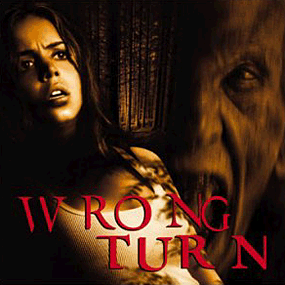
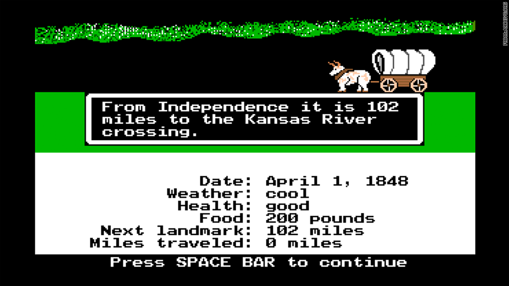

#The Role of Dynamic Documents in Reproduciblity  

##What is a dynamic document?  
* A dynamic document incorporates changes made in your work as you work.  
* Your data changes, your document changes.  
* Your code changes, your document changes.  
* Your story changes, your document changes. . .if you type in the new story.

##Research has many moving parts  
* Text for the story  
* Data  
    - Many years  
    - Many people  
    - Many types  
    - Many sets  
* Code  
    - Figures, tables  
    - Statistical analysis  
* Software   
* Bibliography  

## 

When you start a publication, you don't always have a map of where you're going. This usually means you also can't provide a map of where you've been, even if you can give someone directions on how to get there.  

 

## A dynamic document is more than just a pretty face.  
* Dynamic documents can tie together everything you have done and allow others to reproduce all or part of your work.  
* A good dynamic document requires thoughtful structuring behind the scenes.  

## Dynamic documents are not a new idea.  
When I was playing Oregon Trail, people were planning ways to tie together their text, code, and data in a way that they would not have to repeat work and others could follow what they did.  

  
Probably so they could keep track of their Oregon Trail successes and failures.  

## Statistical Analyses and Reproducible Research  
  Gentleman and Lang, 2004  

  

## Compendium  
  Gentleman and Lang introduce the idea of a *compendium* as both  
  
* a container for the elements that make up a publication  
* a means for distributing, managing, and updating the collection.  

Key Words: Compendium, Dynamic documents, Literate programming, Markup language, Perl, Python, R  

## Compendium  
* Elements of a dynamic document can be extracted and processed by both the author and the reader  
* Elements of the compendium can be used in contexts other than the author's original work    

## Compendium Elements    
Gentleman and Lang define a dynamic document as an ordered composition of code chunks and text chunks.  

* *Code chunks* are sequences of commands in some programming language.  
    - Perform the computations needed to produce the appropriate output  
* *Text chunks* describe the problem, the code, the results, and often their interpretation.  
* *Auxiliary software* is software that is used, but does not appear in the dynamic document.  For example, R packages and functions.  
* *Transformer* is the mechanism or system used to transform a dynamic document into some desired output.  

## Your turn { .cover .white }

<!-- image source https://www.flickr.com/photos/ollemhebb/16691684354/in/photolist-rqZfeh-dB2HGy-j4rtWV-cswQCb-bnmKUX-rurYD7-5vmdw6-7iHPtj-bvggjZ-7nwAyK-oVZdhD-acwkds-dqAf8f-e4z5Jk-6PBenY-dSAYZ9-5vmcGR-e4z7be-cyGrpE-7WLPaw-5vmdnn-8ciEWU-5vmcDa-o2NbGq-dxpJTW-cyGt4d-dZy9Sm-dZssjK-oVZ3SB-5BtrCp-e4z5Mk-6bvjNs-8cfk5H-dzTiW2-7Yfj3T-9mraHV-5XmJTS-aDtnzj-ruXg4M-ecF3x2-aAU6Fg-bsQosb-Hgh9UM-kJti5g-ifdCE4-ceXXhf-7AdkFZ-aEDYpr-otaizi-sa1Phn -->

Talk with a partner about all of the components that need to go into a report or publication. Draw a concept diagram of the connections that need to be made between these components in order to produce a runnable document.
 

 In other words, pretend knitr has not yet been invented. What needs to happen for a dynamic document to become a reality?

  

## Gentleman and Lang  

* Envisioned that not only would compendiums and dyanmic documents allow readers to recreate analyses, they would also change the way a reader interacted with the content.  
* Readers would be able to go through computations as they read the work.  
* Readers could explore alternative computations or parameter values.  

## Further motivation  

* Reviewing the results of papers would no longer need to involve reworking long computations.  
* Or, the results of studies would no longer need to be taken on faith.  
* Implicit assumptions and mistakes can be discovered during peer review.  

## Literate programming  
* Introduced by Knuth in 1992  
* A literate program is a document that is a mixture of code segments and text segements.
* Written to be read by humans rather than a computer and organized as such.  

## Literate programming  
* A literate program should support *weaving* and *tangling*.  
* *Weaving* creates a document for the reader that displays code and text and output such as figures and tables.  
* *Tangling* arranges the code chunk in a way that they are machine readable and runnable.  
* *Sweave* (Leisch 2002) uses R and XML to execute these ideas.  

## Future directions  
* Multi-language compendiums   
* Conditional chunks to tweak documents for different audiences  
* Interactivity  
* Metadata  

##

