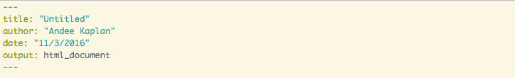

# YAML Ain't Markup Language

## R markdown output formats

**Documents**  

Interactive R Notebooks, HTML, PDF, Microsoft Word (docx), OpenDocument Text, Rich Text Format, Markdown

**Presentations**

HTML presentation with ioslides, reveal.js, W3C Slidy (and more), and PDF presentation with LaTeX Beamer

**More**

Interactive dashboards, R package vignette, books, websites, and interactive documents.

## Your turn { .cover .white }

<!-- image source https://www.flickr.com/photos/ollemhebb/16691684354/in/photolist-rqZfeh-dB2HGy-j4rtWV-cswQCb-bnmKUX-rurYD7-5vmdw6-7iHPtj-bvggjZ-7nwAyK-oVZdhD-acwkds-dqAf8f-e4z5Jk-6PBenY-dSAYZ9-5vmcGR-e4z7be-cyGrpE-7WLPaw-5vmdnn-8ciEWU-5vmcDa-o2NbGq-dxpJTW-cyGt4d-dZy9Sm-dZssjK-oVZ3SB-5BtrCp-e4z5Mk-6bvjNs-8cfk5H-dzTiW2-7Yfj3T-9mraHV-5XmJTS-aDtnzj-ruXg4M-ecF3x2-aAU6Fg-bsQosb-Hgh9UM-kJti5g-ifdCE4-ceXXhf-7AdkFZ-aEDYpr-otaizi-sa1Phn -->

Come up with a list of 5 things you wish you could do with R markdown (formatting or otherwise).

## R markdown flexibility

Each output type has its own flexible options to customize your document. For example:

<ul>
<li>Table of contents</li>
<li>Section numbers</li>
<li>Tabbed sections (HTML)</li>
<li>Figure width, height, captions</li>
<li>Code folding (HTML)</li>
<li>Equation rendering</li>
<li>Templating</li>
<li>Including external documents</li>
<li>Bibliographies</li>
<li>LaTeX options (PDF)</li>
<li>etc.
</ul>

## YAML

We control **all** of these options with YAML front-matter. YAML is a human friendly data serialization standard for all programming languages. 

The YAML header is surrounded by `---`s, and is at the beginning of the document. 

## Available options

You can go to [rmarkdown.rstudio.com](http://rmarkdown.rstudio.com) and find out all the available YAML options for the default document types in R markdown.

If you create your own templates, you can make your own options! For example, you may want to create a template for a journal submission [[example]](https://github.com/gammarama/intRo/tree/papers/jcgs-paper-2016). 

## Your turn { .cover .white }

<!-- image source https://www.flickr.com/photos/ollemhebb/16691684354/in/photolist-rqZfeh-dB2HGy-j4rtWV-cswQCb-bnmKUX-rurYD7-5vmdw6-7iHPtj-bvggjZ-7nwAyK-oVZdhD-acwkds-dqAf8f-e4z5Jk-6PBenY-dSAYZ9-5vmcGR-e4z7be-cyGrpE-7WLPaw-5vmdnn-8ciEWU-5vmcDa-o2NbGq-dxpJTW-cyGt4d-dZy9Sm-dZssjK-oVZ3SB-5BtrCp-e4z5Mk-6bvjNs-8cfk5H-dzTiW2-7Yfj3T-9mraHV-5XmJTS-aDtnzj-ruXg4M-ecF3x2-aAU6Fg-bsQosb-Hgh9UM-kJti5g-ifdCE4-ceXXhf-7AdkFZ-aEDYpr-otaizi-sa1Phn -->

Navigate to <a style="color: black" href="http://rmarkdown.rstudio.com">rmarkdown.rstudio.com</a> and look up how to specify your 5 wishes and implement them in a R markdown document.

<b>Hint:</b> Think about what type of document you want first.

If you don't have a wish list, try mine (PDF Document):

<ol style="color: white">
<li>Table of contents</li>
<li>Numbered sections</li>
<li>Allow figure captions</li>
<li>Set default figure size to 4in by 3in</li>
<li>Set margins to 1in</li>
</ol>

