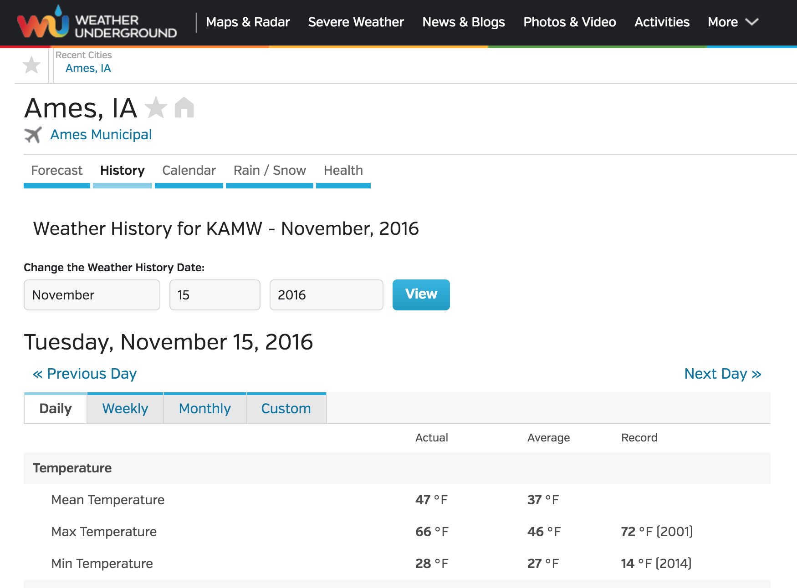
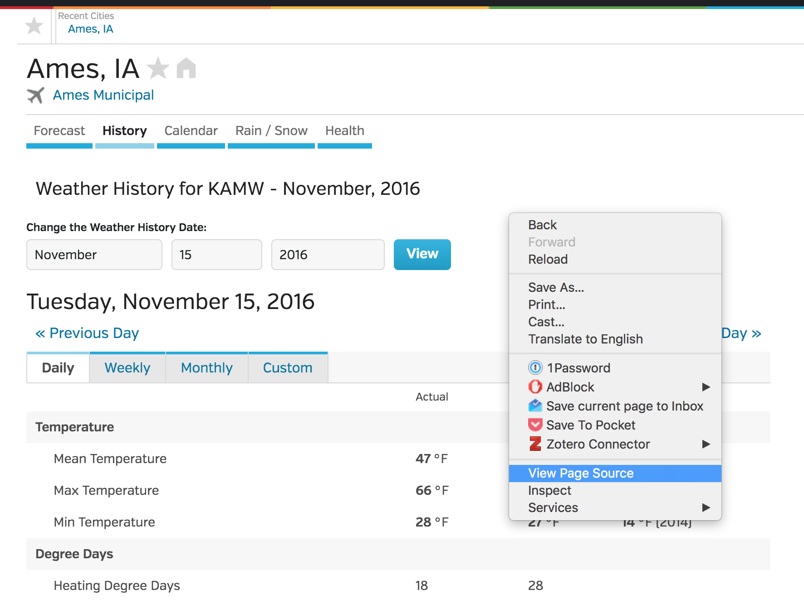
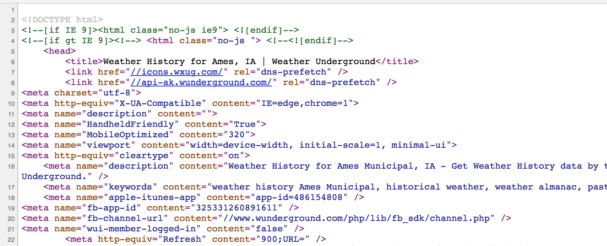
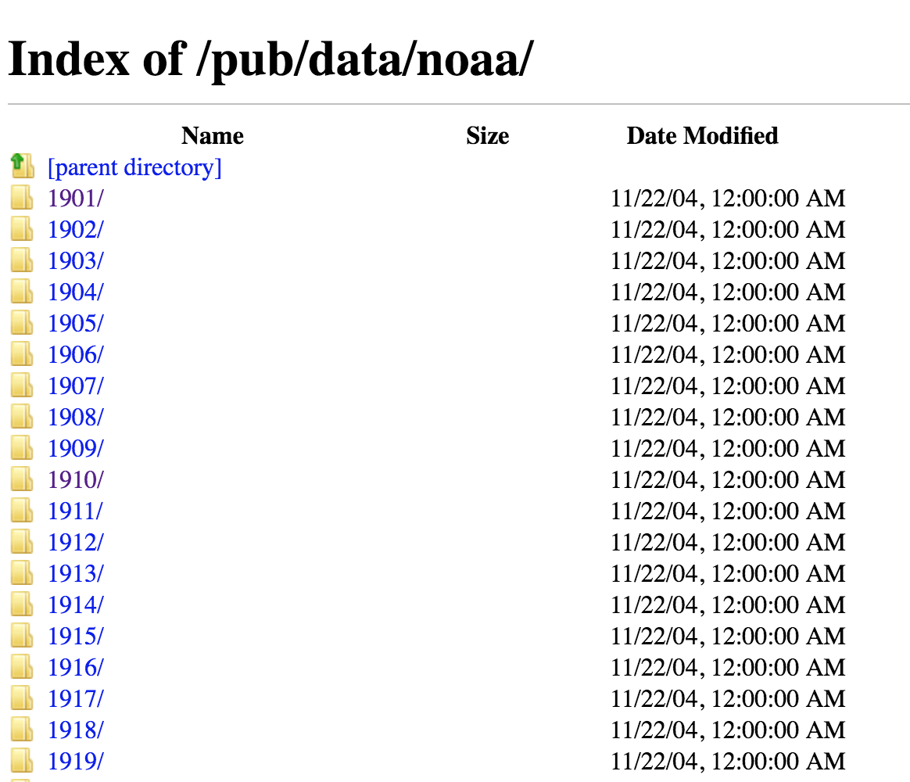
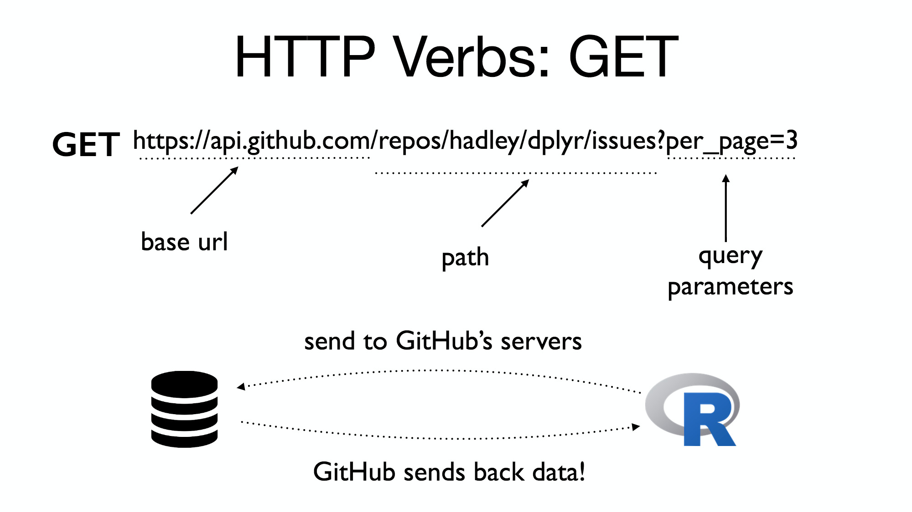

```{r echo=FALSE}
knitr::opts_chunk$set(
  warning = FALSE,
  message = FALSE,
  comment = "#>"
)
```

## Data on the Web

Scott Chamberlain

`r Sys.Date()`


## Data Sources

Data on the web can include

* HTML
* Files in FTP servers of lots of different formats
* Database dump
* APIs
* etc ...

## How to get it?

* HTML --> scrape
* Files (e.g., csv) --> scrape and/or download
* Files in FTP servers of lots of different formats --> download and parse
* Database dump --> SQL or other DB client
* APIs --> HTTP client

## Data type faceoff

|                 |  Yay! | Boo! |
|:---------------:|:-----:|:-----:|
|   Scraping      | Mostly always an option | Code breaks easily    |
|                 |                         | Can be blocked easily |
|   Files/FTP     | Likely an R thing to read it |  Links to files can break |
|   |  |  Watch out for huge files |
|   Database dump | Great if you know SQL  |  Not so great if you don't |
|   | Flexible query syntax  |   |
|   | Avoid R memory lim.  |   |
|   API           | Interface is stable(ish)  | Not great when want "all the data" |
|   | HTTP is a good UI | HTTP APIs are not standarized |

## Web gotchas

* Is the internet up or down?
* Your IP address may matter
* Is the remote website/server up or down?
* Using an HTTP client, useful to debug
* Don't reveal your authentication details

## Scraping

Let's scrape some weather data 



## Scraping

`rvest` is an easy way to get started

```{r}
library('rvest')
url <- paste0(
  "https://www.wunderground.com/history/airport/",
  "KAMW/2016/11/15/DailyHistory.html"
)
weather_data <- read_html(url)
head(html_table(weather_data)[[1]])
```

## Scraping

What did we just do?

Go to `View Page Source` by right-clicking on the page



## Scraping

The source is a pile of html. Very exciting!



## Scraping - Your turn

__3 minutes__

* Pick a city of your choice from Weather Underground
* Navigate to the history tab
* Get the URL
* Scrape the html
* Get any table

## Scraping bonus

Use [SelectorGadget](http://selectorgadget.com/) to find the xpath to 
an HTML element.

## FTP

<center>FTP = [File Transfer Protocol](https://en.wikipedia.org/wiki/File_Transfer_Protocol)</center>

## FTP

They look like this



## FTP

* No specialized FTP R packages
* Getting FTP files:
    * Any HTTP client package: `crul`, `curl`, `httr`, `RCurl`
    * `download.file()`
    * `read.table` and friends
    * etc.
* Some FTP servers require username and password

## FTP

Example FTP data collection

Download file

```{r echo=FALSE}
url <- "ftp://ftp.ncdc.noaa.gov/pub/data/noaa/1991/010510-99999-1991.gz"
```

```{r eval=FALSE}
library("httr")
url <- "ftp://ftp.ncdc.noaa.gov/pub/data/noaa/1991/010510-99999-1991.gz"
res <- GET(url, write_disk(path = basename(url)))
res$request$output$path
```

OR

```{r}
download.file(url, destfile = basename(url))
```

## FTP

Then, read data

```{r}
readLines(basename(url), n = 10)
```

## Protip

Use our package [isdparser][isdparser]

```{r}
library(isdparser)
isd_parse(path = basename(url))
```

## FTP - Your turn 

__3 minutes__

* Go to <ftp://ftp.ncdc.noaa.gov/pub/data/noaa/>
* Pick a file
* Get the URL
* Download the file
* Read in some lines

## APIs

* API == Application Programming Interface
* A set of rules for one thing to communicate with another
* E.g., when you login with Facebook on another site, you're
using the Facebook API
* can be lots of things:
    * the exported functions of an R package
    * A public web API
    * the interface to a database
    * the interface to an operating system
* Place to look for APIs: <http://www.programmableweb.com>

## (web) APIs

Web APIs are:

* Code to expose a user interface on top of a database
* Documentation is often quite good
* Routes are defined to do certain things: e.g. 
    * `/search` - to search
    * `/<species id>` - to get data on a particular species by ID
* Most web APIs involve HTTP - get to know HTTP

## (web) APIs

Components



## (web) APIs

R clients for APIs

* `crul` - <https://github.com/ropenscilabs/crul>
* `request` - <https://github.com/sckott/request>
* `curl` - <https://github.com/jeroenooms/curl>
* `httr` - <https://github.com/hadley/httr>

## (web) APIs

```{r}
library("request")
library("dplyr")
res <- api("http://omdbapi.com") %>% 
  api_query(s = "iron man", r = json) 
res$Search
```

## (web) APIs - Your turn 

__3 minutes__

* Use the base url <http://omdbapi.com> (and navigate to 
the page in browser)
* Look at the documentation
* Using code example from previous slide, search for a movie

## rOpenSci

<center>
We connect you to open data

Check us out at <https://ropensci.org>

We'd love to help with data problems that fit in our wheelhouse.

Contribute! It's a great way to learn more R.
</center>

## rOpenSci packages of interest

* [rnoaa](https://github.com/ropensci/rnoaa) - Lots of NOAA data
* [laselva](https://github.com/ropenscilabs/laselva) - FIA data in R
* [isdparser][isdparser] - Parse NOAA ISD files

lots more ..., check out <https://ropensci.org/packages>

### Further reading

* [HTTP and APIs in depth](https://github.com/sckott/user2016http/blob/master/01-http.pdf)


[isdparser]: https://github.com/ropenscilabs/isdparser
